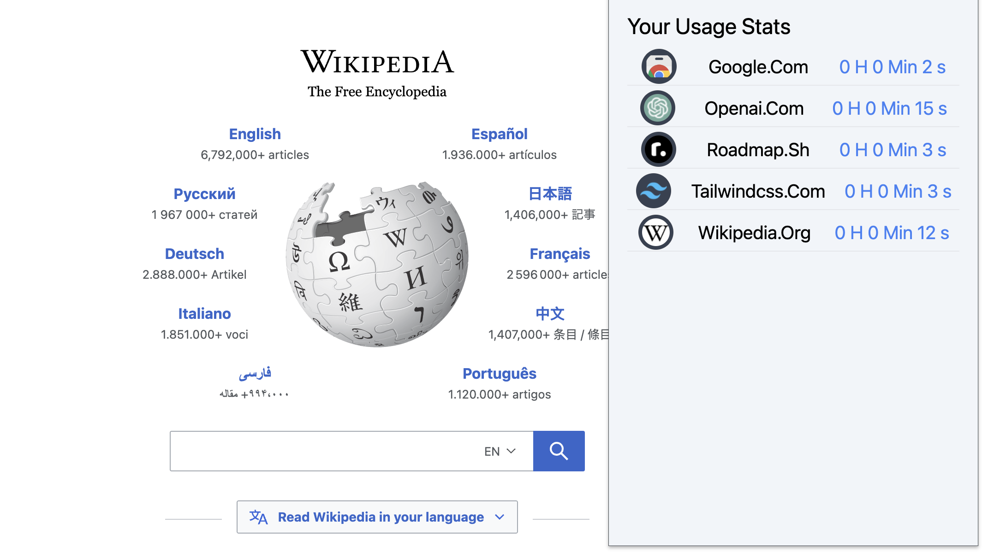
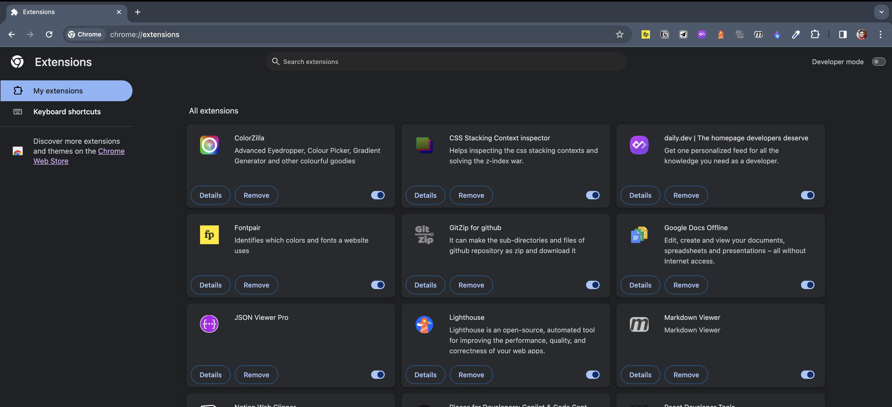
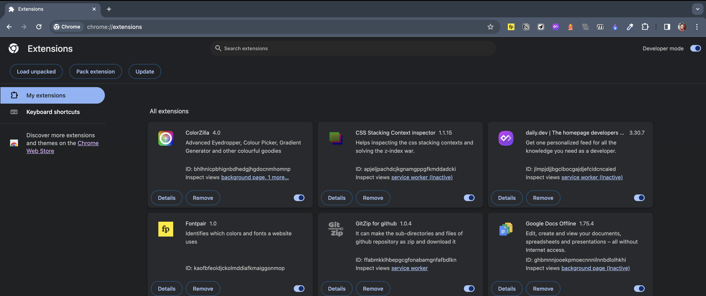
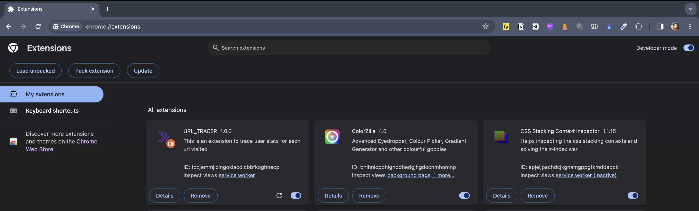

<div align='center'>
    <h1 align='center'>Url Tracer</h1>
    <h3>The chrome extension which gives your url usage stats on web.</h3>
</div>

<div align='center'>
    <a href="https://twitter.com/Yashcsp22"></a>
</div>

<br/>

Url Tracer is a chrome extension which traces and lists how much time user spend their browsing time on a particular tab.

## Features

- **Usage Stats:** This provides your personal usage stats which helps to find out on which you are spending more time while web surfing. This helps in your productivity.
- **Self-hosted, open-source:** Host it yourself and hack on it

## Demo



## Tech Stack

- [Javascript](https://developer.mozilla.org/en-US/docs/Web/JavaScript)
- [Tailwind](https://tailwindcss.com/) – CSS
- [Laravel Mix](https://laravel-mix.com/) - Bundler

## Getting Started

### Prerequisites

Here's what you need to be able to run Url Tracer:

### 1. Clone the repository

```shell
git clone https://github.com/YashwanthKothakota9/url-tracer.git
cd url-tracer
```

You will find `src` folder. I have used `yarn` package manager.

### 2. Install npm dependencies

```shell
npm install -g yarn
yarn install
```

### 3. Pack the extension

```shell
npx mix
```

It will create two folders `build` and `dist` inside `url-tracer` folder.

### 4. Use Extension

- Open `Chrome` and navigate to `chrome://extensions`.
  
- Turn on `developer mode`.
  
- Click on `load unpacked` which is on left corner.
- Select `url-tracer/dist` folder
  
- Now surf the internet and at the end of your work click on the `extension` icon you will see your usage stats.

## Contributing

Url-tracer is an open-source extension which is aimed to help people to increase their productivity while surfing the web by knowing which task is costing their most amount of time.

If you'd like to contribute, please fork the repository and make changes as you'd like. Pull requests are warmly welcome.

### Additional information about developing extensions

### Popups

Mobile view of your extension. Viewport is limited 800px by 600px.

### Extension Pages

Desktop view of your extension.You can access these extension pages through URLs like:

```
chrome-extension://{YOUR_EXTENSION_ID}/{page}.html
```

Your extension will have a unique ID that belongs to it and allows you to reference these pages.

### Content Scripts

Content scripts are what make browser extensions powerful. Content scripts are scripts that can be embedded into a tab.They have permissions to access the extension APIs to interact with the browser and higher level tools (dev tools, screenshots, browser storage, etc.) BUT they also have access to the DOM (page data, elements, etc.). This means you can communicate from your extension to the content script and interact with page elements. You can add a button that adds additional functionality, compute data that’s not computed, or gather feedback.You will have to add permissions to your manifest when adding content scripts.

### Background Scripts

Think of background scripts as the “API” to your extension.Use background scripts for registering alarms (timed processes), managing state, facilitating communication, injecting content scripts through code (good for dynamically injected content scripts), adding context menus (right click) or pretty much any “always on” type of function or communication.Background scripts are always headless so you won’t use any of the frontend tools you might use elsewhere.

```js
"icons": {
    "16": "/images/icons/icon-16x16.png",
    "32": "/images/icons/icon-32x32.png",
    "48": "/images/icons/icon-48x48.png",
    "128": "/images/icons/icon-128x128.png"
  },
```

When passing a message from any part of your extension to any other part of your extension, you pass an object.

This target key is the part of the extension should listen for this message. I also pass an action key which is what method should be run. Then any data I pass along with the message is passed with the data key.

Example:

```js
await browser.runtime.sendMessage({
  target: 'BACKGROUND',
  action: 'ANNOUNCE_USER',
  data: {
    name: 'Dan',
  },
});
```

Here’s the base level targets I use:

- BACKGROUND - Any message sent to the background service worker script.
- POPUP - Any message sent to the popup script.
- CONTENT - Any message sent to the content script.
- PAGE - Any message sent to the extension’s page

```js
"content_scripts": [
{
"matches": ["<all_urls>"],
"js": ["content/index.js"]
}
],
```

In this chrome extension only `POPUP` and `BackgroundScript` is used.
